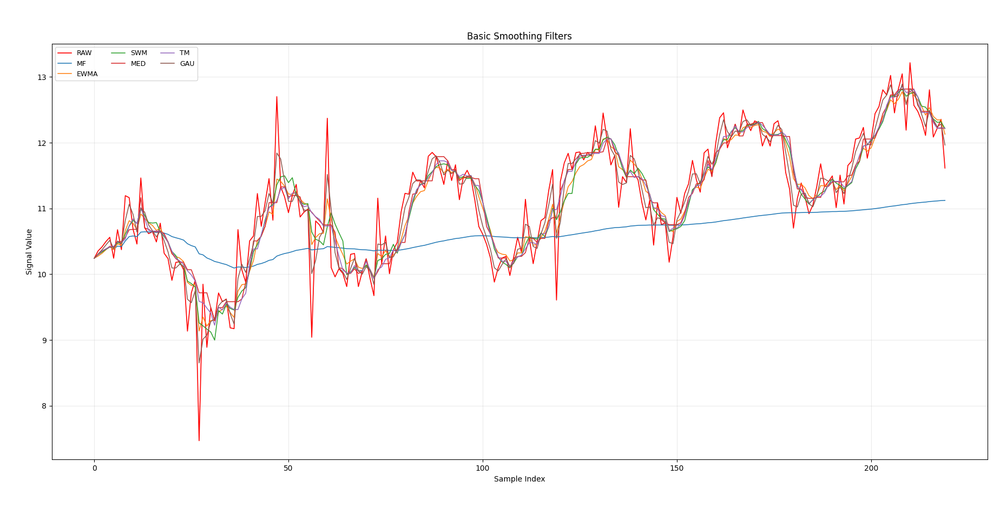
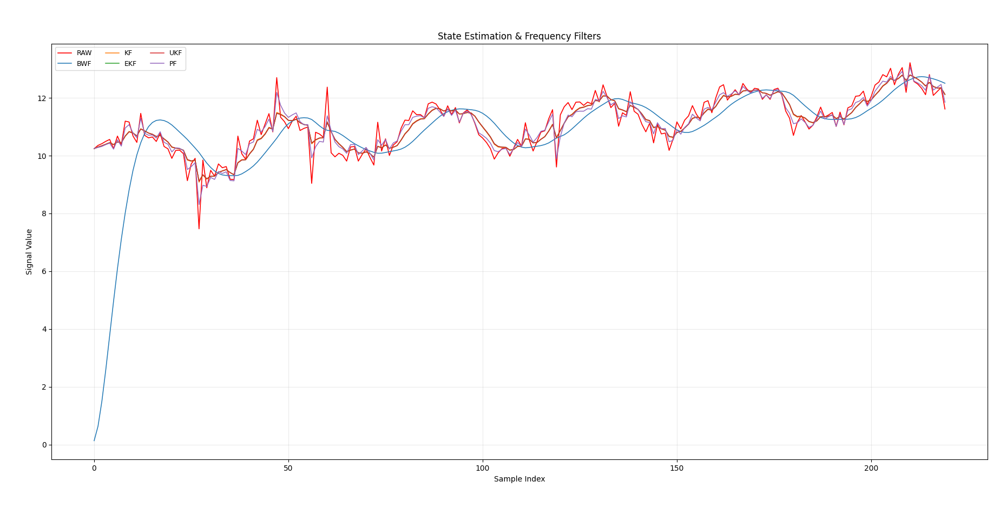

# EasyFilter - 轻量级一维滤波器库

[English Version](./README_en.md)

`EasyFilter` 是一个简单易用的滤波器库，面向一维标量数据的平滑、抗噪与状态估计。

当前版本提供 14 个滤波器，统一接口风格，适合快速实验和工程落地。

## 项目结构

```text
main/
├── MyFilter/
│   ├── ButterworthFilter.py
│   ├── ClampFilter.py
│   ├── ComplementaryFilter.py
│   ├── EKalmanFilter.py
│   ├── EWMAFilter.py
│   ├── GaussianFilter.py
│   ├── HysteresisFilter.py
│   ├── KalmanFilter.py
│   ├── MeanFilter.py
│   ├── MedianFilter.py
│   ├── ParticleFilter.py
│   ├── SWMFilter.py
│   ├── TMFilter.py
│   ├── UKalmanFilter.py
│   └── __init__.py
├── examples/
│   ├── demo_all_filters.py
│   └── plot_filter_groups.py
├── LICENSE
├── README.md
├── FilterList.txt
└── requirements.txt
```

## 安装

```bash
git clone https://github.com/LiO2-coder/EasyFilter.git
cd EasyFilter
pip install -r requirements.txt
```

## 依赖

- Python 3.8+
- numpy>=1.19.0
- scipy>=1.7.0
- matplotlib>=3.5.0

## 快速开始

```python
from MyFilter import SWMFilter, EWMAFilter, KalmanFilter

swm = SWMFilter(window_size=5)
print(swm.update(1.2))  # (1.2, False)

ema = EWMAFilter(alpha=0.3)
print(ema.update(1.2))

kf = KalmanFilter(x=0.0, Q=0.1, R=1.0)
print(kf.update(1.2))
```

## 滤波器列表

### 基础平滑类

| 滤波器           | 核心接口                            | 特点                                           | 优点                         | 局限                                     | 典型场景                           | 关键参数建议                                                           |
| ---------------- | ----------------------------------- | ---------------------------------------------- | ---------------------------- | ---------------------------------------- | ---------------------------------- | ---------------------------------------------------------------------- |
| `MeanFilter`     | `update(x)`                         | 对历史观测值做累计均值，输出非常平滑的滤波值。 | 实现最简单，适合做长期基线。 | 对新变化响应慢。                         | 长周期温度趋势、慢变量基线估计。   | 需要阶段性重置时可定期调用`reset()`。                                  |
| `EWMAFilter`     | `update(x)`                         | 指数加权平均，越新的观测值权重越高。           | 在平滑与响应速度之间可调。   | `alpha` 不合适时可能过慢或过抖。         | 实时传感器去抖、价格曲线平滑显示。 | 默认从`alpha=0.2~0.4` 起调；想更快就增大 `alpha`。                     |
| `SWMFilter`      | `update(x) -> (滤波值, 窗口满标志)` | 固定窗口均值，窗口内观测值等权。               | 平滑稳定，结果直观。         | 窗口过大时滞后明显。                     | 采样频率稳定的一维数据平滑。       | `window_size=3~7` 常用；噪声重时增大窗口。                             |
| `MedianFilter`   | `update(x) -> (滤波值, 窗口满标志)` | 取窗口中位数，天然抑制孤立异常值。             | 抗脉冲噪声能力强。           | 对连续高斯噪声平滑能力弱于均值类。       | 距离传感器偶发跳点、触控信号毛刺。 | 常用奇数窗口`3/5/7`，窗口越大越稳但更滞后。                            |
| `TMFilter`       | `update(x) -> (滤波值, 窗口满标志)` | 对窗口排序后去掉两端极值再求均值。             | 在保留趋势的同时抑制极端值。 | 参数约束严格，`trim_size` 过大信息损失。 | 带离群点的工业测量序列。           | 先用`window_size=5, trim_size=1`，并保持 `2*trim_size < window_size`。 |
| `GaussianFilter` | `update(x) -> (滤波值, 窗口满标志)` | 窗口高斯加权，越近的观测值权重越高。           | 比等权窗口更强调最近状态。   | `sigma` 与窗口搭配不当会退化。           | 平滑且希望保留局部动态细节的曲线。 | 先设`window_size=5`，`sigma` 取 `1.0~1.5` 再微调。                     |

### 规则/融合类

| 滤波器                | 核心接口                                             | 特点                               | 优点                           | 局限                         | 典型场景                         | 关键参数建议                                |
| --------------------- | ---------------------------------------------------- | ---------------------------------- | ------------------------------ | ---------------------------- | -------------------------------- | ------------------------------------------- |
| `ClampFilter`         | `update(x)`                                          | 将观测值限制在上下界内。           | 对超量程值保护直接有效。       | 不是平滑器，只做范围裁剪。   | 传感器保护、输入安全边界控制。   | 先根据物理量程设置`min_value/max_value`。   |
| `HysteresisFilter`    | `update(x)`                                          | 变化未超过死区时保持上次滤波值。   | 显著减少小抖动触发。           | 死区过大可能吞掉真实小变化。 | 开关阈值判定、UI 数值防抖显示。  | `deadband` 可从噪声峰峰值的 `0.5x` 起试。   |
| `ComplementaryFilter` | `update(measurement, prediction=None, control=None)` | 融合预测值与观测值输出单一滤波值。 | 可利用模型预测并保持实现轻量。 | 依赖`alpha` 与预测质量。     | IMU 姿态一维融合、简化状态融合。 | `alpha` 先用 `0.9~0.98`；预测不可靠时下调。 |

### 状态估计与频域类

| 滤波器              | 核心接口            | 特点                                           | 优点                             | 局限                           | 典型场景                             | 关键参数建议                                       |
| ------------------- | ------------------- | ---------------------------------------------- | -------------------------------- | ------------------------------ | ------------------------------------ | -------------------------------------------------- |
| `ButterworthFilter` | `update(x)`         | 基于 IIR 的流式频域滤波，支持低/高/带通/带阻。 | 频率选择明确，对周期噪声控制好。 | 需合理设置采样频率与截止频率。 | 电信号去工频干扰、低通平滑控制输入。 | 优先确认`fs`；低通通常从较低 `cutoff` 起调。       |
| `KalmanFilter`      | `update(z, u=None)` | 一维线性状态估计，融合预测与观测值。           | 估计稳定且可解释。               | 需要线性模型假设与噪声参数。   | 匀速或近线性过程的状态估计。         | 先固定`R`，逐步调整 `Q` 控制跟随速度。             |
| `EKalmanFilter`     | `update(z, u=None)` | 对非线性模型做一阶线性化后估计状态。           | 可处理轻中度非线性系统。         | 线性化误差会影响稳定性。       | 非线性传感器映射、简化动力学估计。   | 先保证`state_func/measure_func` 连续，再调 `Q/R`。 |
| `UKalmanFilter`     | `update(z, u=None)` | 无需显式雅可比，通过 sigma 点传播非线性。      | 非线性场景下通常比 EKF 更稳健。  | 参数更多，调参成本更高。       | 非线性但维度较低、希望保留精度。     | 常用起点`alpha=1e-3, beta=2, kappa=0`。            |
| `ParticleFilter`    | `update(z, u=None)` | 用粒子群近似后验分布，适配复杂非高斯噪声。     | 对强非线性、非高斯问题更灵活。   | 计算开销大，粒子数影响明显。   | 多峰噪声、遮挡严重或模型不确定场景。 | 从`num_particles=300~800` 起步，先调噪声尺度。     |

## 如何选择滤波器

### 按噪声类型

- 高频抖动为主：优先 `EWMAFilter`、`SWMFilter`、`GaussianFilter`。
- 脉冲噪声/离群点明显：优先 `MedianFilter` 或 `TMFilter`，必要时前置 `ClampFilter`。
- 缓慢漂移且偶发跳变：优先 `EWMAFilter`，对跳变敏感业务可配合 `HysteresisFilter`。
- 周期性噪声（特定频段）：优先 `ButterworthFilter`（低通或带阻）。

### 按系统约束

- 低算力、强实时：优先 `MeanFilter`、`EWMAFilter`、`ClampFilter`。
- 有可用过程模型（线性）：优先 `KalmanFilter`。
- 有可用过程模型（非线性）：优先 `EKalmanFilter` 或 `UKalmanFilter`。
- 非线性且噪声复杂（非高斯/多峰）：优先 `ParticleFilter`。

### 快速选择（被上面好专业的选择方法吓哭了）

1. 只想快速去抖且实现最轻：先用 `EWMAFilter(alpha=0.3)`，再按响应速度调 `alpha`。
2. 数据含明显毛刺：先用 `MedianFilter(window_size=5)`，若仍偏抖再加 `EWMAFilter`。
3. 既要去异常又要保留均值趋势：先用 `TMFilter(window_size=5, trim_size=1)`。
4. 已知有效量程：先上 `ClampFilter` 做保护，再串联平滑滤波器。
5. 小波动导致频繁触发：先用 `HysteresisFilter(deadband=噪声幅值)`。
6. 采样频率明确且有频段目标：优先 `ButterworthFilter`，先确认 `fs` 后调 `cutoff`。
7. 有状态模型并需要状态估计：先 `KalmanFilter`，再根据非线性程度升级到 `EKalman/UKalman`。
8. 模型不可靠且噪声分布复杂：先 `ParticleFilter`，逐步增加粒子数观察稳定性与耗时。

## 滤波效果


*图1：基础平滑类*


*图2：规则/融合类*

*图3：状态估计与频域类*


## 示例脚本

运行全量示例：

```bash
python3 examples/demo_all_filters.py
```

示例覆盖：

- 平稳信号 + 脉冲噪声 + 缓慢漂移
- 所有滤波器的最小可运行用法
- EKalman/UKalman/Particle/Complementary 的可注入模型示例

运行分组绘图示例：

```bash
python3 examples/plot_filter_groups.py
```

图表说明：

- 使用 `random` 库生成一组随机信号
- 生成三张折线图，分别对应：

1. 基础平滑类（`MF`, `EWMA`, `SWM`, `MED`, `TM`, `GAU`）
2. 规则/融合类（`CLP`, `HYS`, `CMP`）
3. 状态估计与频域类（`BWF`, `KF`, `EKF`, `UKF`, `PF`）

- 每张图均包含原始数据 `RAW` 与该组全部滤波器曲线
- 原始数据统一为红色

## 说明

- 本库当前定位为一维轻量实现，不做多维状态泛化。
- 方法命名均以规范好，例如 `get_filtered()`。

## TODO: 开发计划(作者给自己画饼)

### 卡尔曼滤波器升级

当前 v1.0 版本为简单的一阶卡尔曼滤波器，后续将更新：

- **多维卡尔曼滤波器** - 支持多状态变量
- **自适应卡尔曼滤波器** - 动态调整噪声参数
- **联邦卡尔曼滤波器** - 多传感器数据融合
- **容积卡尔曼滤波器** - 高精度非线性估计

### 开发C++版本

## 贡献

欢迎提交 Issue 和 Pull Request！对于新功能建议或问题反馈，请创建 GitHub Issue。

## 许可证

本项目采用 MIT 许可证 - 查看 [LICENSE](LICENSE) 文件了解详情。

## 作者


- **GitHub**: [https://github.com/LiO2-coder](https://github.com/LiO2-coder)

## 版本历史

- **v1.0** - 初始版本发布
  
  - 实现三种基本滤波器
  - 提供完整的 API 文档和示例
- **v1.1** - 新增11种滤波器
  
  - 实现基础平滑类、规则/融合类、状态估计与频域类共十四种常用滤波器
  - 提供完整的 API 文档和示例
  - 提供滤波器选型指导
  - 图像显示三类滤波器的滤波效果

## 支持

如果您在使用过程中遇到任何问题，可以通过以下方式联系：

- GitHub Issues: [项目 Issues 页面](https://github.com/LiO2-coder/EasyFilter/issues)

---

⭐ 第一个项目，如果这个项目对您有帮助，请给个Star！

